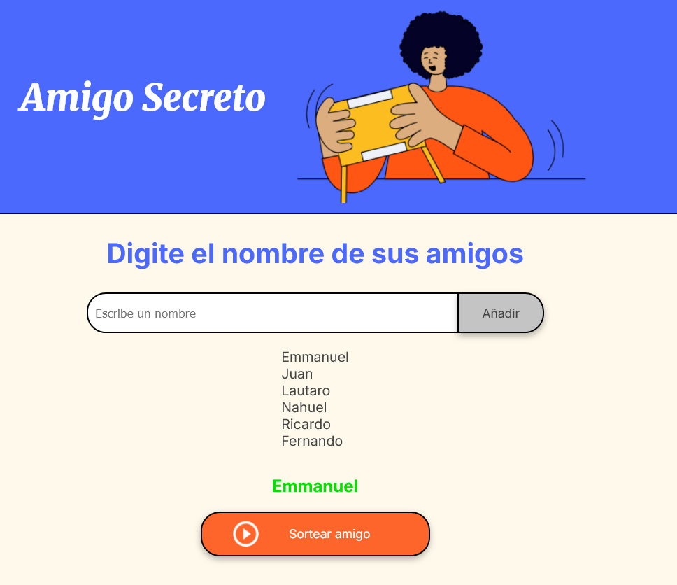

# 🎁 Amigo Secreto - Aplicación Web

¡Organiza sorteos de amigo secreto de manera fácil y divertida! Esta aplicación web permite agregar participantes, validar entradas y realizar sorteos aleatorios con un solo clic.

  


## 🌟 Funcionalidades

- **Agregar nombres**: Ingresa participantes mediante un campo de texto intuitivo.
- **Validación en tiempo real**: Alerta si el campo está vacío.
- **Lista visual dinámica**: Muestra todos los participantes registrados.
- **Sorteo instantáneo**: Selección aleatoria con animación incluida.
- **Diseño responsive**: Compatible con dispositivos móviles y desktop.

## 🛠️ Cómo usar

### 1. Agregar participantes
1. Escribe un nombre en el campo _"Escribe un nombre"_.
2. Haz clic en **Añadir**.
3. ¡El nombre aparecerá en la lista de abajo!


### 2. Realizar sorteo
1. Asegúrate de tener al menos un nombre en la lista.
2. Haz clic en el botón **Sortear amigo** 🎉.
3. ¡El resultado se mostrará en verde bajo la lista!


### 3. Validación del campo
1. En caso de que el campo no tenga una cadena y se de click en "Añadir".
2. Se mostrarpá un Alert con el mensaje que solicita se inserte un nombre.


## ⚙️ Instalación
```bash
git clone https://github.com/EmmanuelMontes/ChallengeAmigoSecreto.git
cd amigo-secreto
# Abrir index.html en tu navegador